# Inventa POS

Inventa POS is a full-stack retail point-of-sale platform for multi-store operations. This repository contains a Spring Boot backend, a React + Vite frontend, and a shared project knowledge base used to capture architecture decisions, role flows, analytics work, and operational fixes.

The platform is built around role-based workflows for super admins, store admins, branch managers, and cashiers. It covers onboarding, branch and employee management, catalog and inventory operations, checkout flows, refunds, shift reporting, analytics dashboards, exports, subscription plans, and payment-link based billing.

## Repository Layout

| Path | Purpose |
|---|---|
| `POS---System` | Spring Boot backend API, business logic, persistence, auth, analytics, subscriptions, and payments |
| `POS---System-frontend` | React 19 + Vite single-page application with role-based dashboards |
| `brain` | Shared project notes, architecture audits, change history, and runbooks |

## Core Capabilities

- Multi-role access model with dedicated route trees and dashboards
- Store, branch, employee, category, and product management
- Inventory-aware retail operations and cashier checkout flows
- Returns, refunds, and shift-summary workflows
- Store-level and branch-level analytics dashboards
- CSV export flows for reporting and operations
- Subscription plans and upgrade flows
- Payment link integration with Razorpay and Stripe support
- Historical data seeding and project-specific operational runbooks

## Role Coverage

### Super Admin

- Platform-level oversight
- Store review and moderation workflows
- Subscription plan management
- Export surfaces for store and platform reporting

### Store Admin / Store Manager

- Store-level management across branches
- Branch, product, category, and employee administration
- Store sales dashboards and reports
- Branch-filtered analytics and CSV exports
- Subscription upgrade flow

### Branch Manager / Branch Admin

- Branch operations, inventory, orders, and employees
- Day-wise and month-wise reporting
- Demand forecasting and reorder insights
- AI-assisted branch health summaries

### Cashier

- POS checkout and customer-linked order creation
- Returns and refund execution
- Shift lifecycle and shift summary workflows
- Order history and receipt-related operations

## Technology Stack

### Frontend

- React 19
- Vite 7
- React Router
- Redux Toolkit
- Tailwind CSS 4
- Radix UI primitives
- Recharts
- Axios

### Backend

- Spring Boot 3.5
- Spring Web
- Spring Security with JWT
- Spring Data JPA
- MySQL
- Jakarta Validation
- Spring Mail
- Razorpay Java SDK
- Stripe Java SDK
- Maven

## System Architecture

```mermaid
flowchart LR
    User["Platform Users<br/>Super Admin / Store Admin / Branch Manager / Cashier"]
    SPA["React + Vite SPA<br/>POS---System-frontend"]
    Router["Role-based Routing<br/>App.jsx + route modules"]
    Store["Redux Toolkit Store<br/>auth, user, store, branch, order, analytics, subscription"]
    API["REST API Layer<br/>Axios + Vite dev proxy"]
    Backend["Spring Boot API<br/>POS---System"]
    Security["Security Layer<br/>JWT validation + role checks"]
    Services["Service Layer<br/>orders, inventory, analytics, refunds, subscriptions, payments"]
    Repos["Repository Layer<br/>Spring Data JPA"]
    DB["MySQL Database"]
    External["External Services<br/>Razorpay / Stripe / Email"]
    Brain["Project Knowledge Base<br/>brain/"]

    User --> SPA
    SPA --> Router
    Router --> Store
    Store --> API
    API --> Backend
    Backend --> Security
    Security --> Services
    Services --> Repos
    Repos --> DB
    Services --> External
    Brain -. informs implementation and operations .-> SPA
    Brain -. informs implementation and operations .-> Backend
```



## Backend Architecture

The backend follows a layered Spring Boot structure:

- `controller`: HTTP entry points for auth, stores, branches, orders, analytics, subscriptions, payments, and refunds
- `service` and `service/impl`: business workflows and orchestration
- `repository`: persistence access through Spring Data JPA
- `modal`: JPA entities for platform, retail, and billing domains
- `payload`: DTOs, request models, and response wrappers
- `configrations`: JWT, security, and supporting infrastructure
- `exception`: centralized exception and security error handling

### Core backend domains

- Organization: `Store`, `Branch`, `User`
- Catalog and stock: `Category`, `Product`, `Inventory`
- Transactions: `Order`, `OrderItem`, `Refund`, `ShiftReport`
- Billing: `SubscriptionPlan`, `Subscription`, `PaymentOrder`

## Frontend Architecture

The frontend is a role-driven single-page application.

- Session restoration and role routing are centralized in `src/App.jsx`
- State is managed through Redux Toolkit in `src/Redux Toolkit/globleState.js`
- Role-specific routes are defined in `src/routes`
- Major UI surfaces live under `src/pages/store`, `src/pages/Branch Manager`, `src/pages/cashier`, `src/pages/SuperAdminDashboard`, and `src/pages/common`

### Frontend data flow

1. User authenticates and receives a JWT
2. JWT is persisted in `localStorage`
3. App startup restores the session and fetches the current user profile
4. Role-based routes are selected centrally
5. Pages dispatch async thunks to call backend APIs
6. Redux slices store UI state for dashboards and workflows

## Local Development

### Prerequisites

- Node.js 18+
- npm
- Java 17
- Maven Wrapper support
- MySQL 8+

### Backend Setup

From [`POS---System`](D:/Projects/Inventa-POS/POS---System):

```powershell
./mvnw.cmd spring-boot:run
```

The backend runs on `http://localhost:5000`.

#### Backend Configuration

The application reads configuration from [`POS---System/src/main/resources/application.yml`](D:/Projects/Inventa-POS/POS---System/src/main/resources/application.yml). Key settings include:

- `DB_HOST`, `DB_PORT`, `DB_NAME`, `DB_USERNAME`, `DB_PASSWORD`
- `RAZORPAY_KEY`, `RAZORPAY_SECRET`
- `STRIPE_SECRET`
- `MAIL_USERNAME`, `MAIL_PASSWORD`

Default local database target:

```text
jdbc:mysql://localhost:3306/pos2
```

### Frontend Setup

From [`POS---System-frontend`](D:/Projects/Inventa-POS/POS---System-frontend):

```powershell
npm install
npm run dev
```

The frontend runs on `http://localhost:5173`.

During local development, Vite proxies API traffic to `http://localhost:5000` through [`POS---System-frontend/vite.config.js`](D:/Projects/Inventa-POS/POS---System-frontend/vite.config.js).

### Build Commands

#### Frontend

```powershell
cd POS---System-frontend
npm run build
npm run test
```

#### Backend

```powershell
cd POS---System
./mvnw.cmd compile
./mvnw.cmd test
```

## Important Project Notes

- The frontend and backend are developed as separate apps inside one repository root
- JWT-based authentication is used across protected app routes and API endpoints
- Some project notes call out contract-drift risks between frontend thunks and backend endpoints, so integration validation remains important when extending flows
- Payment and subscription flows rely on external providers and should be tested with environment-specific credentials

## Knowledge Base

The shared [`brain`](D:/Projects/Inventa-POS/brain) directory is the repository's running knowledge base. It includes:

- architecture and role audits
- analytics and export implementation notes
- historical seed runbooks
- bug-fix sweeps and change tracking

Useful starting documents:

- [`brain/001-workspace-overview.md`](D:/Projects/Inventa-POS/brain/001-workspace-overview.md)
- [`brain/002-fullstack-architecture-roles-audit.md`](D:/Projects/Inventa-POS/brain/002-fullstack-architecture-roles-audit.md)
- [`brain/015-role-features-superadmin-storeadmin-branchmanager-cashier-apr-23.md`](D:/Projects/Inventa-POS/brain/015-role-features-superadmin-storeadmin-branchmanager-cashier-apr-23.md)
- [`brain/CHANGELOG.md`](D:/Projects/Inventa-POS/brain/CHANGELOG.md)

## Roadmap Opportunities

- Add a stricter frontend-to-backend contract matrix for all role flows
- Expand integration and role-based automated tests
- Standardize DTO use across all entity-backed endpoints
- Improve secret and environment management for production readiness
- Add deployment documentation and environment-specific setup guides

## License

No license is currently declared in this repository.
